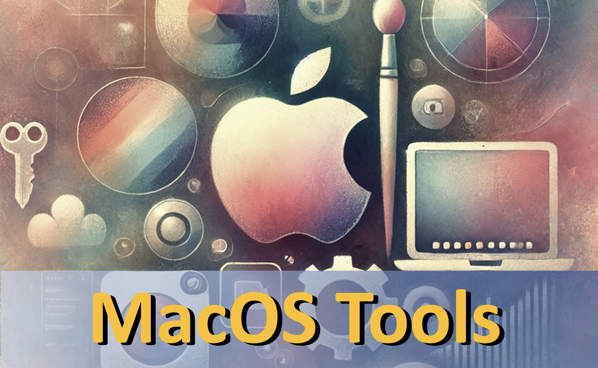

--------------------------------------------------------------------------------

# MacOS Tools

Provides Bash-script based tools for MacOS.

| Tool    | Description                        |
|---------|------------------------------------|
| sc      | screen capture                     |
| spacer  | create spacer for Mac desktop dock |

* Quick help is supported for all tools with `-?` option
* MacOS tools are in general not running on Linux or WSL platforms


## Installation

* clone git repository `https://github.com/bluccino/tool-mac.git`
* copy scripts in repository's `bin` folder to a local binary folder which is
  part of `$PATH` and use `changemod +x ...` to enable execution flags

A more convenient installation using `pimp` command can be found in the appendix.


## Screen Capture Tool `sc`

* activates a 'rubber band' to capture and save a rectangular screen section
  to `~/Downloads/screenshot.png`
* file path of captured screenshot can be optionally provided
* use `sc -?` for quick help


## Spacer Tool `spacer`

* to create a spacer in Mac desktop dock
* such created spacer can then be dragged with the mouse to any desired dock
  position
* use `spacer -?` for quick help


## Appendix: Convenient Installation Using Pimp Tool

### Installation of Pimp

* if `pimp` is installed ignore the following `pimp` installation process
* Otherwise, In a `bash` shell with installed `curl` execute the following
  one-line command to download and install `pimp`. Select a number from the list
  of potential install directories (which are extracted from your PATH).

```sh
  HUB=https://raw.githubusercontent.com/bluccino; \
      curl -s $HUB/tool-pimp/master/bin/pimp >~pimp; bash ~pimp -!
```

### Convenient Installation of Mac Tools

* install from `https://github.com/bluccino/tool-pimp.git`
* clone Mac Tools' git repository

```sh
   git clone https://github.com/bluccino/tool-mac.git
```

* Navigate to repository root directory and execute

```sh
   cd tool-mac  # navigate to repository root directory
   . pimp       # create virtual environment (based on provided `.pimp` recipe)
   $ pimp -d    # deploy mac tools by selecting a proper binary target directory
```
